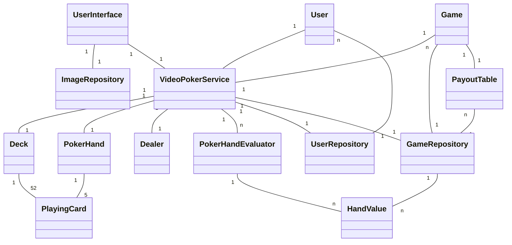

# Arkkitehtuurikuvaus

Ohjelman rakenne noudattelee kolmikerrosarkkitehtuuria, ja koodin pakkausrakenne on seuraava:

Pakkaus _ui_ sisältää käyttöliittymäkoodin, _services_ sovelluslogiikan ja _repositories_ tietojen pysyväistallennuksesta vastaavan koodin. Pakkaus _entities_ sisältää luokkia, jotka kuvaavat sovelluksen käsitteellisiä objekteja.

## Käyttöliittymä

Käyttöliittymä sisältää kolme erillistä näkymää:

- Peliprofiilin valinta
- Videopokeri pelin

Kaikki näkymät on toteuteuttu omina luokkinaan. Näkymistä yksi on aina kerrallaan näkyvänä. Näkymien näyttämistä koordinoi [UI](../src/ui/ui.py)-luokka. Käyttöliittymä on pyritty eristämään täysin sovelluslogiikasta, joka on palvelukerroksessa. Käyttöliittymä kutsuu [VideoPokerService](../src/services/videopokerservice.py)-luokan metodeja.

Sovellus on Videopokeri, jonka pelaaminen on monille tuttua huoltoasemilta ja marketeista.

Kun pelikortteja vaihdetaan eli kun jaetaan uusi käsi tai kädessä vaihdetaan kortteja, niin kutsutaan sovelluksen [initialize_hand_view](https://github.com/nuuttikuosa/ohjelmistotekniikka2024/blob/main/videopoker/src/ui/video_poker_view.py) metodia, joka renderöi korttinäkymän uudelleen palvelukerrokselta saamiensa pelikorttien perusteella,

Sovelluksen pelaaminen on hyvin samanlaista eri käyttäjille, vain käyttäjien pelitilin saldo on käyttäjäkohtainen. Yksi kierros peliä maksaa yhden yksikön ja voitot määräytyvät voittotaulukon mukaan.

## Sovelluslogiikka
Sovelluksen loogisen tietomallin muodostavat luokat:
- [PlayingCard](https://github.com/nuuttikuosa/ohjelmistotekniikka2024/blob/main/videopoker/src/entities/card.py), joka kuvaa pelikorttia
- [Dealer](https://github.com/nuuttikuosa/ohjelmistotekniikka2024/blob/main/videopoker/src/entities/dealer.py), joka kuvaa korttipelin jakajaa ja jaka käden ja uudet pelikortit.
- [Deck](https://github.com/nuuttikuosa/ohjelmistotekniikka2024/blob/main/videopoker/src/entities/deck.py), joka kuvaa korttipakkaa
- [Game](https://github.com/nuuttikuosa/ohjelmistotekniikka2024/blob/main/videopoker/src/entities/game.py), joka kuvaa tiettyä videopokeria ja sen sääntöjä ja voittotaulukkoa.
- [PokerHand](https://github.com/nuuttikuosa/ohjelmistotekniikka2024/blob/main/videopoker/src/entities/hand.py), joka kuvaa pokerikättä eli joukkoa pelikortteja.
- [HandValue](https://github.com/nuuttikuosa/ohjelmistotekniikka2024/blob/main/videopoker/src/entities/hand_value.py), joka kuvaa käden arvoa. esim. suora, väri, kaksi paria tai hai.
- [PayoutTable](https://github.com/nuuttikuosa/ohjelmistotekniikka2024/blob/main/videopoker/src/entities/payout_table.py), joka kuvaa tietyn videopokerin voittoaulukkoa
- [PokerHandEvaluator](https://github.com/nuuttikuosa/ohjelmistotekniikka2024/blob/main/videopoker/src/entities/pokerevaluator.py), joka kuvaa käden arviointisääntöjä eli pelin sääntöjä.
- [User](https://github.com/nuuttikuosa/ohjelmistotekniikka2024/blob/main/videopoker/src/entities/user.py), joka kuvaa pelaajaa

Ohjelman tluokkien väliset suhteet ovat:

## Päätoiminnallisuudet

Kuvataan seuraavaksi sovelluksen toimintalogiikka  päätoiminnallisuuden osalta sekvenssikaaviona.

Alussa sovellut avaa peliprofiilin valintanäytön, johon on haettu tietokannasta siellä olevat peliprofiilit (pelaajan nimi ja pelitilin saldo). Käyttäjä voi valita olemassaolevat peliprofiilin tain luoda uuden.

Seuraavaksi sovellus hakee tietokannasta oletuspelin, _jätkä tai parempi_ tiedot ja voittotaulukon.

 Ohjelma jakaa hänelle käden ja arvioi käden korttiyhdistelmät. Käyttää voi halutessaan vaihtaa kortteja kädessä ja ohjelma vaihtaa kortit, arvioi kortityhdistelmät ja laskee käyttäjän voiton ja päivittää käyttäjän pelitilin saldon.

Kehitysversiossa kortit käytetään käyttöliittymällä kirjainyhdistelminä, mutta seuraavassa versiossa otetaan käyttöön png-tyyppiset kuvat pelikorteille.

## Rakenne

Ohjelman luokkakaavio on seuraavanlainen:

## Ohjelman rakenteeseen jääneet heikkoudet

### Videopokerikäsien arviointi
Keskeinen arviointifunktio on hieman liian pitkä ja monimutkainen. Pylint ilmoittaa liian pitkistä ja monimutkaisista metodeista luokan PokerHandEvaluator metodissa basic_evaluation. Evaluointi on kuitenkin logiikaltaan sellainen, että jos se jaettaisiin kahteen funktioon, niin koodin looginen ymmärrettävyys kärsisi, joten olen pitänyt tämän toiminnallisuuden yhtenä kokonaisuutena. Periaatteessa suorien ja värien arvioinnin voi eriyttää muutta käden arvioinnista.

### Käyttöliittymä

Käyttöliittymän ryhmittelyä voisi parantaa rajattomasti, mutta koska en ole kovinkaan visuaalinen henkilö. Oikeassa ohjelmistoprojektissa käyttöliittymän viilaus olisi UX designerin eikä toteuttajan tehtävä.
