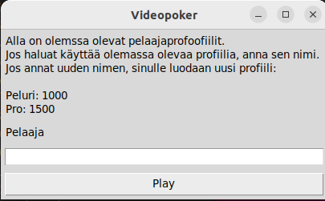
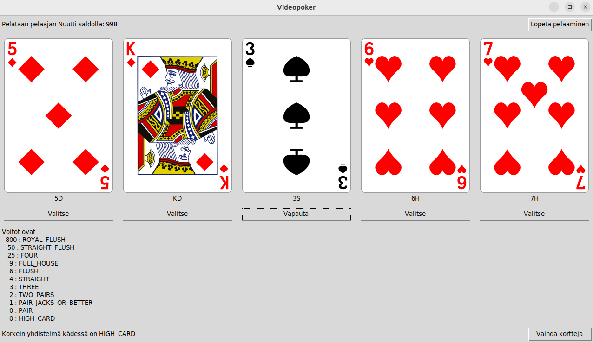
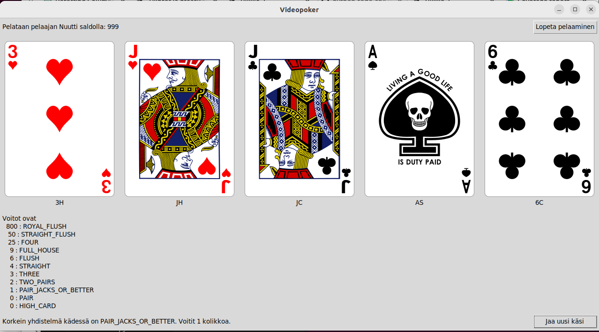

# Käyttöohje

Lataa projektin viimeisimmän [releasen](https://github.com/ohjelmistotekniikka-hy/python-todo-app/releases) lähdekoodi valitsemalla _Assets_-osion alta _Source code_.

## Konfigurointi

Tallennukseen käytettävän tietokannan nimeä ja lokitiedostojen nimiä voi muuttaa muokkaamalla käynnistyshakemistossa olevaa _.env_-tiedostoa. Tietokanta luodaan _data_-hakemistoon build komennolla, jos sitä ei ole. Lokitoedostot sijaitsevat _logs_-hakemistossa  Konfiguraation muoto on seuraava:

```
DATABASE_FILENAME=game_database.sqlite
GAME_EVENT_LOG_FILENAME = game_event_log.log
```

## Ohjelman käynnistäminen

Ennen ohjelman käynnistämistä, asenna riippuvuudet komennolla:

```bash
poetry install
```

Jonka jälkeen suorita alustustoimenpiteet komennolla:

```bash
poetry run invoke build
```

Nyt ohjelman voi käynnistää komennolla tekstikäyttöliittymään:

```bash
poetry run invoke start
```

## Kirjautuminen

Sovellus käynnistyy Peliprofiilinäkymään:



Ikkunassa näkyy tietokannassa olevat pelaajaprofiilit ja niiden pelitilien saldot. On mahdollista valita olemassa oleva pelaajaprofiili kirjoittamalla pelaajaprofiilin nimi tai voidaan luoda uusi pelaajaprofiili kirjoittamalla uuden pelaajaprofiilin nimi.

Pelaaminen alkaa painamalla "Play"-painiketta.

## Videopokerin pelaaminen

Pelaajaprofiilin valitsemisen jälkeen siirrytään videopokerin pelaus näkymään:




Peli jakaa käyttäjälle viisi korttia, joista jokaisen alla on lukitsemispainike "Valitse", jollla lukitaan ne kortit jotka halutaa pitää toiselle kierrokselle.

Kun painetaan "Vaihda Kortit", niin halutut kortit vaihdetaan ja paras korttiyhdistelmä arvioidaan:



## Videopokerin pelaamisen lopettaminen
Kun käyttäjä päättää lopettaa videopokerin pelaamisen, niin sovellus tallentaa pelitilin saldon tietkantaa seuraavaa pelisessiota varten.
