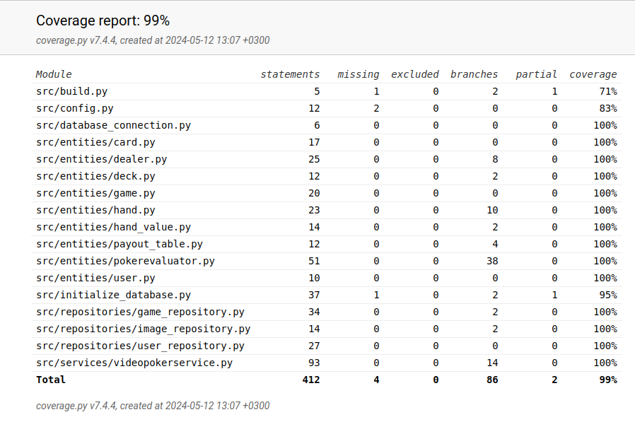

# Testausraportti 12.5.2024

Videopokeri-sovellukselle on suoritettu manuaalinen järjestelmätesti. Tämän lisäksi sovellusta on testattu automaattisesti yksikkö- ja integraatiotestein unittestilla ennen jokaista koodin pushausta githubiin.

## Yksikkö- ja integraatiotestaus
### Sovelluslogiikka
Sovelluslogiikasta vastaavaa VideoPokerService-luokkaa testataan TestVideoPokerService-testiluokalla.
Sovelluksessa on käytössä satunnaisuuteen perustuva Dealer-luokka. TodoService-olio alustetaan, niin että sille injektoidaan riippuvuudeksi Dealer-olio, joka on testeissä alustettu aina samalla seed arvolla (seed = 3). Tällä tavalla Dealer-olio jakaa aina samat kortit.
TodoService-luokkaa testataan yksikkötesteissä siten, että sille on injektoitu riippuvuudeksi repositorio-oliot, jotka tallentavat tietoa muistiin pysyväistallennuksen sijaan. Tätä varten testissä on käytössä luokat FakeGameRepository ja FakeUserRepository.

Tämän lisäksi tehdään automatisoitu integraatiotestaus, jossa käytetään TodoService-luokan oliota, jotka käyttää tietokantaan yhteydessä olevia repository-luokkia, jotka palauttavat tiedot testitietokannasta.

Automatisoidussa integraatiotestauksessa käytössä oleva testitietokanta generoidaan aina uudestaan samanlaiseksi ennen testauksen aloittamista.

# Repositorio-luokat
Repositorio-luokkia TodoRepository ja UserRepository testataan ainoastaan testeissä käytössä olevilla tiedostoilla. Tiedostojen nimet on konfiguroitu .env.test-tiedostoon. TodoRepository-luokkaa testataan TestTodoRepository-testiluokalla ja UserRepository-luokkaa TestUserRepository-testiluokalla.
Repositorio-luokkaa ImageRepository luokkaa testataan samoilla kuvatiedostoilla, jotka ovat käytössä myös varsinaisessa sovelluksessa, koska näille suoritetaan ainoastaan lukuoperaatioita.

# Entiteeti-luokat
Sovelluksessa on seuraavat entiteettiluokat: PlayingCard, Dealer, Deck, Game, PokerHandd, HandValue, PayoutTable, PokerHandEvaluator ja User. Näillä on vastaavat testiluokat, jotka sisältävät entiteettien yksikkötestit.

### Automaatiotestauksen testauskattavuus
Käyttöliittymäkerrosta lukuun ottamatta sovelluksen testauksen haarautumakattavuus on 99%

Automaatiotestauksen ulkopuolelle jäivät _build.py_- ja _initialize\_database.py_-tiedostojen suorittaminen komentoriviltä ja Dealer-luokan testaus tämänhetkiseen kellonaikaan perustuvalla seed:illä. Nämä on testattu manuaalisesti järjestelmätestin laajuudessa.

## Järjestelmätestaus

Videopokeri-sovellukselle on suoritettu manuaalinen  järjestelmätesti. Kaikki järjestelmätestissä löytyneet sovellusvirheet on korjattu julkaisuversioon 1.0.

### Asennus ja konfigurointi

Sovellus on haettu ja sitä on testattu käyttöohjeen mukaisesti cubbli-Linux-ympäristössä. Testauksessa on käytetty myös eri tiedostopolkuja ja  konfiguraatioita _.env_-tiedostoa muokkaamalla.

Sovellusta on testattu sekä tilanteissa, joissa käyttäjät ja työt tallettavat tiedostot ovat olleet olemassa ja joissa niitä ei ole ollut jolloin ohjelma on luonut ne itse.

### Toiminnallisuudet

Kaikki vaatimusmäärittelyn ja käyttöohjeen kuvaamat toiminnallisuudet on testattu.

## Hyväksymistestaus

Asiakas - Projektitiimin parisuhde on suorittanut sovellukselle hyväksymistestauksen ja hyväksynyt sovelluksen vastaamaan vaatimuksia. Asiakkaan mielestä ainoa merkittävä puute sovelluksessa on, että se on hyödytön ("What usefull can I do with this? Play poker? It's waste of time.").

## Sovelluksen tunnetut puutteet.

Sovellut ei anna tällä hetkellä kunnollisia virheilmoituksia, jos:

- Tietokantaa ei ole alustettu
- Sovelluksen tietokanta katoaa kesken sovelluksen suorituksen
- Sovelluksen tarvitsemat kuvatiedostot puuttuvat.